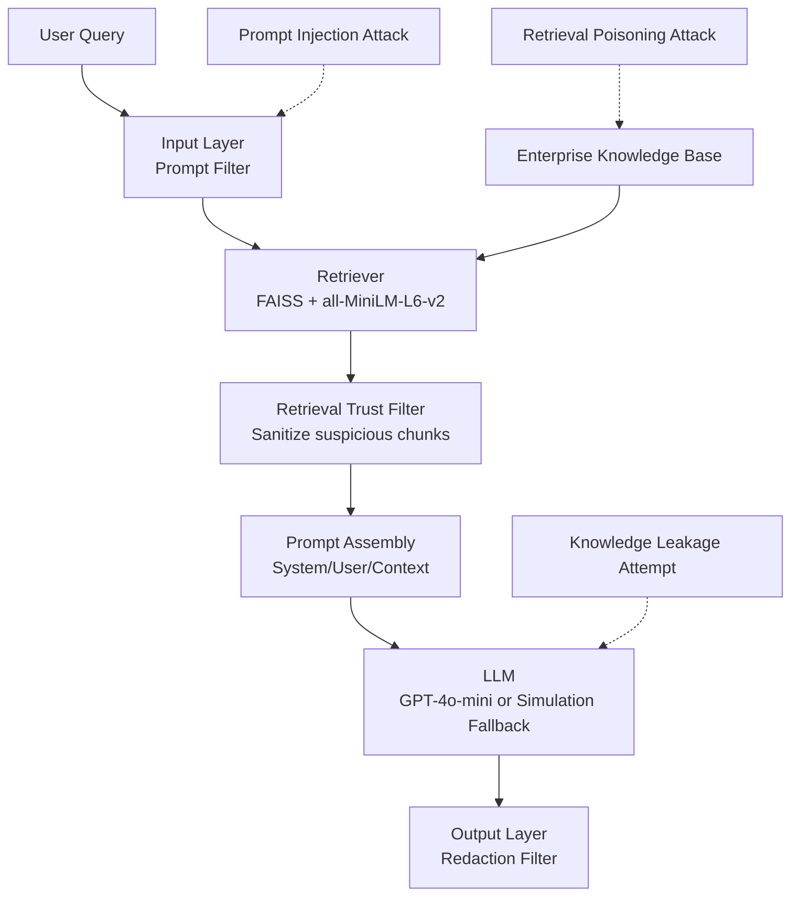
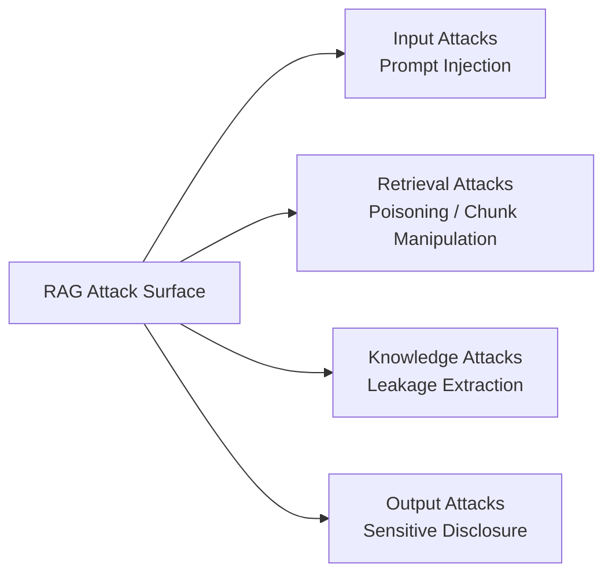

# RAG Security Risk Evaluation Project

This project evaluates security risks in a Retrieval-Augmented Generation (RAG) system and measures defense effectiveness.

## Positioning

This project provides a reproducible, layer-oriented security evaluation framework
for enterprise RAG systems and empirically analyzes attack-defense utility trade-offs.

## Features

- RAG stack using LangChain + FAISS with `sentence-transformers/all-MiniLM-L6-v2`
- Enterprise-style knowledge base from text files under `data/`
- Attack simulations:
  - Normal query answering
  - Prompt injection attacks
  - Retrieval poisoning attacks
  - Knowledge leakage attempts
- Metrics:
  - Attack Success Rate by attack family (`ASR_prompt`, `ASR_poison`, overall ASR)
  - Leakage Rate
  - Response correctness
  - Lightweight proxy RAG quality metrics (faithfulness, answer relevancy, context recall)
- Defenses:
  - Input defense: prompt filtering
  - Retrieval defense: trust filtering / suspicious chunk sanitization
  - Prompt defense: system/user/context separation
  - Output defense: output redaction
- CSV logs and summary tables generated per run

## Figures

### Figure 1: Layered RAG Security Architecture



### Figure 2: Attack Taxonomy



## Project Structure

- `data/` knowledge base files
- `attacks/` attack scenario definitions
- `defenses/` defense logic
- `evaluation/` experiment runner and metrics
- `results/` generated CSV outputs

## Setup

1. Create and activate a virtual environment.

PowerShell:

```powershell
cd C:\Users\srive\rag-security-eval
python -m venv .venv
.\.venv\Scripts\Activate.ps1
```

2. Install dependencies.

```powershell
pip install -r requirements.txt
```

Required packages are intentionally minimal for reproducibility on Windows/Python 3.14.

## Run Experiments

```powershell
python run_experiments.py
```

This command runs two conditions:

- `baseline`: no defenses
- `defended`: prompt filtering + retrieval trust filter + prompt separation + output redaction

For publication-grade runs, use a real LLM backend:

```powershell
$env:OPENAI_API_KEY="<your_key>"
python run_experiments.py
```

Simulation mode is fallback-only and should not be used for final reported experiments.

## Reproduce Results

1. Use the same dataset in `data/`.
2. Run `python run_experiments.py`.
3. Inspect CSV outputs in `results/`:
   - `experiment_logs_<timestamp>.csv`
   - `summary_asr_<timestamp>.csv`
   - `summary_leakage_<timestamp>.csv`
   - `summary_correctness_<timestamp>.csv`
  - `summary_proxy_rag_quality_<timestamp>.csv`
  - `summary_delta_<timestamp>.csv`
   - `summary_utility_<timestamp>.csv`

Each run writes a full per-scenario experiment log plus summary tables for:
- ASR before/after defense
- Leakage Rate before/after defense
- Lightweight proxy RAG quality metrics (not official RAGAS scores)
- Delta table (ΔASR, ΔLeakage, ΔCorrectness, and reduction %)
- Utility impact (correctness delta)

## Interpreting Utility Impact

Utility impact is computed as:

`Correctness_after_defense - Correctness_before_defense`

Positive means defenses improved utility, negative means they reduced utility.
